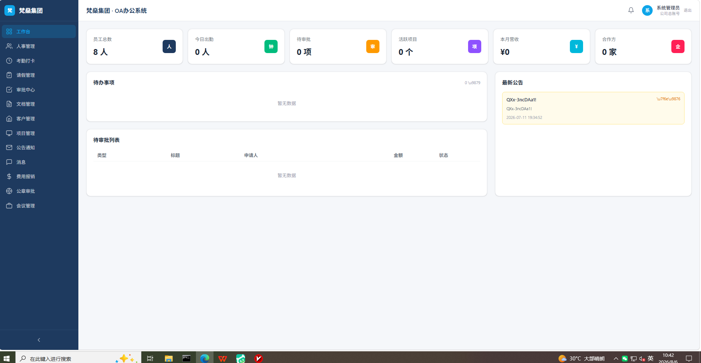

# 梵燊集团 OA 办公自动化系统

> 梵燊集团 OA 办公自动化系统

> 🚀 **[在线演示](https://oa.qyfanshen.com)** · 📚 **[文档](docs/)** · 📋 **[快速开始](docs/QUICKSTART.md)** · 🐛 **[反馈问题](https://github.com/qyfanshen/oa.qyfanshen/issues)** · ⭐ **[Star](https://github.com/qyfanshen/oa.qyfanshen)**


<p align="center">
  <a href="https://github.com/qyfanshen/oa.qyfanshen"></a>
  <a href="https://github.com/qyfanshen/oa.qyfanshen/actions"></a>
  <a href="https://img.shields.io/github/languages/code-size/qyfanshen/oa.qyfanshen"></a>
  <a href="https://github.com/qyfanshen/oa.qyfanshen/issues"></a>
  <a href="https://github.com/qyfanshen/oa.qyfanshen/stargazers"></a>
</p>

---

**梵燊集团 OA** 是基于 Next.js 16 的 AI 办公自动化系统——DeepSeek 文档分析、考勤、审批与公告一站式完成。

[English](README.md) | [中文](README.zh.md)

## 核心使用场景

- **📄 AI 文档分析** — 上传 PDF/Word/Markdown，通过 DeepSeek 生成摘要、思维导图与问答。
- **👤 员工自助服务** — 考勤、审批、公告与内部沟通在一个应用内完成。
- **🔐 安全认证** — JWT 保护的路由 + MySQL 持久化 + 基于角色的访问控制。

## 特色功能

### 核心功能
- AI 文档分析：摘要、思维导图（markmap）、基于 DeepSeek 的问答
- 多格式文档解析：PDF（pdf-parse）、Word（mammoth）、Markdown、纯文本
- 用户与权限：bcrypt + JWT（jose），middleware 路由保护
- MySQL 持久化存储，配套 init 脚本（auth / db / ai）
- Tailwind 4 现代化 UI，组件化架构
- 生产就绪：lint 配置、类型检查、.env.example 驱动配置

### 技术特性
- 现代化技术栈：Next.js 16 · React 19 · TypeScript · Tailwind CSS 4 · MySQL · DeepSeek AI · markmap · mammoth · pdf-parse
- 隐私与安全：HTTPS 强制、安全响应头、敏感文件隔离
- SEO 就绪：`sitemap.xml`、`robots.txt`、语义化标签
- 许可证：MIT

## 截图预览

实地登录后台的真实截图：

### 工作台（登录后）


---

## 快速部署

> **环境要求**：Node.js 20.9+（建议 22 LTS）、npm 10+
>
> **必填配置**：克隆后执行 `cp .env.example .env.local`，并按需填入 `DEEPSEEK_API_KEY`、`DB_PASSWORD` 等值。
>
> **Windows 提示**：如 `git clone` 报 `unable to checkout working tree`，先执行 `git config --global core.autocrlf false` 再克隆。

三行命令即可启动：

```bash
git clone https://gitee.com/qyfanshen/oa.qyfanshen.git
cd oa.qyfanshen.com
npm install && npm run dev   # open http://localhost:3000
```

> 完整步骤（Nginx、环境变量、生产部署）见 [docs/DEPLOYMENT.md](docs/DEPLOYMENT.md)。
## 常见问题（Troubleshooting）

- **`git clone` 报 `unable to checkout working tree`**：Windows 换行符兼容问题，先执行 `git config --global core.autocrlf false` 再克隆。
- **`npm install` 失败（ENOENT）**：确认已进入项目根目录（存在 `package.json`）。
- **Node 版本过低报错**：Next.js 16 需要 Node 20.9+，用 `nvm use 22` 或升级 Node。
- **`DEEPSEEK_API_KEY` 未配置**：复制 `.env.example` 为 `.env.local` 并填入真实 Key，否则 AI 功能不可用。
- **数据库连接失败**：确认 MySQL 已启动、`DB_NAME/DB_USER/DB_PASSWORD` 与 `.env.local` 一致，并先执行 `npm run init:db`。

## 使用指南

1. 配置环境：`cp .env.example .env.local` 并填入数据库与 AI 密钥
2. 按需执行数据库初始化脚本（见 `package.json` scripts：init:auth / init:db / init:ai）
3. 开发模式 `npm run dev`，生产模式 `npm run build && npm start`
4. 访问 http://localhost:3000 并用管理员账号登录

## 项目结构

```
oa.qyfanshen.com/
├── README.md            # 英文说明
├── README.zh.md         # 本文件（中文说明）
├── AGENTS.md            # AI 协作说明
├── TODO.md              # 路线图与待办
├── CHANGELOG.md         # 版本历史
├── CONTRIBUTING.md      # 贡献指南
├── LICENSE              # MIT 许可证
├── src/app/            # Next.js App Router（路由）
├── PRIVACY.md           # 隐私政策
├── screenshots/         # 视觉素材
│   ├── README.md
│   └── preview.png
├── docs/                # 补充文档
│   ├── QUICKSTART.md
│   ├── ARCHITECTURE.md
│   ├── DEPLOYMENT.md
│   ├── API.md
└── .github/             # Issue 模板与 CI 工作流
    ├── ISSUE_TEMPLATE/
    ├── workflows/ci.yml
    └── PULL_REQUEST_TEMPLATE.md
```

## 架构说明

## 概述

- **项目**：梵燊集团 OA 办公自动化系统
- **类型**：Next.js 16 应用
- **技术栈**：Next.js 16 · React 19 · TypeScript · Tailwind CSS 4 · MySQL · DeepSeek AI · markmap · mammoth · pdf-parse

## 模块划分


- **App Router**：`app/` 下采用 Next.js App Router（Server + Client Components）。
- **API Routes**：`app/api/*` 提供 RESTful 接口。
- **AI 能力**：`ai/` 模块封装 DeepSeek 等 LLM 调用，输出摘要、思维导图、问答。


## 数据流

```
[Browser]
   │
   ├─── 静态资源（Nginx / CDN）
   │

   ├─── /api/* (Next.js) ──► [MySQL] + [DeepSeek AI]

   │
   └─── /admin/*（如适用）
```

## 安全设计

- HTTPS 强制（301 跳转）
- 安全响应头：CSP / X-Frame-Options / Referrer-Policy / Permissions-Policy
- 敏感文件（`.env`、`*.bak.*`、`storage/`、`.user.ini`）通过 `.gitignore` + Nginx deny 双重保护
- 接口限流（PHP 站 `api/rate_limit.php`）
- CSRF token 校验（PHP 站 `includes/csrf.php`）

## 开发指南

- 按项目约定进行 lint / format
- 提交前运行 `git status` 自检
- 遵守 `.env.example` 中的安全约定

## API 参考

完整接口列表见 [`docs/API.md`](docs/API.md)。当前模块：

- `app/api/auth`
- `app/api/documents`
- `app/api/ai`
- `app/api/users`

## 部署

## 生产部署

### 1. 构建生产包

```bash
cd /var/www/oa.qyfanshen.com
npm install
npm run build
```

### 2. Nginx 反向代理（推荐）

```nginx
server {
    listen 80;
    server_name oa.qyfanshen.com;
    return 301 https://$server_name$request_uri;
}

server {
    listen 443 ssl http2;
    server_name oa.qyfanshen.com;

    ssl_certificate     /etc/nginx/ssl/fanshen-oa.crt;
    ssl_certificate_key /etc/nginx/ssl/fanshen-oa.key;

    # 安全头
    add_header X-Frame-Options "SAMEORIGIN" always;
    add_header X-Content-Type-Options "nosniff" always;
    add_header Referrer-Policy "strict-origin-when-cross-origin" always;
    add_header Permissions-Policy "geolocation=(), microphone=(), camera=()" always;

    # 反向代理到 Next.js（默认 3000 端口）
    location / {
        proxy_pass http://127.0.0.1:3000;
        proxy_http_version 1.1;
        proxy_set_header Upgrade $http_upgrade;
        proxy_set_header Connection "upgrade";
        proxy_set_header Host $host;
        proxy_set_header X-Real-IP $remote_addr;
        proxy_set_header X-Forwarded-For $proxy_add_x_forwarded_for;
        proxy_set_header X-Forwarded-Proto $scheme;
    }

    # 静态资源缓存
    location ~* \.(css|js|jpg|jpeg|png|gif|svg|woff2?)$ {
        expires 7d;
        add_header Cache-Control "public, max-age=604800, immutable";
    }

    # 禁止访问敏感文件
    location ~ /\.(env|user\.ini|htaccess|bak\.|composer\.json|composer\.lock|package\.json|\.git) {
        deny all;
        return 404;
    }
}
```

### 3. 进程管理

使用宝塔「Node 项目管理器」或 PM2 启动：

```bash
# PM2 方式
cd /var/www/oa.qyfanshen.com
npm install pm2 -g
pm2 start npm --name "oa" -- start
pm2 save
pm2 startup
```

### 4. 部署后检查清单

- [ ] HTTPS 已生效（浏览器锁图标）
- [ ] `https://oa.qyfanshen.com/.env` 返回 404
- [ ] 安全响应头可在 https://securityheaders.com 验证为 A 或 A+
- [ ] sitemap.xml 可访问
- [ ] robots.txt 可访问
- [ ] 隐私页可访问（Next.js 路由）

## 行为准则

请阅读我们的[行为准则](CODE_OF_CONDUCT.md)——友善待人，互相尊重。

## 安全

发现安全漏洞？💖 非常感谢你负责任地披露！

在报告之前，请先花一分钟看看 [安全政策](SECURITY.md)，这样能帮助我们更快响应，也避免遗漏重要信息。

## 贡献

我们非常欢迎你的贡献！💖

如果你愿意参与，可以先看看 [CONTRIBUTING.md](CONTRIBUTING.md)，并使用 [Issue 模板](.github/ISSUE_TEMPLATE/) 与 [PR 模板](.github/PULL_REQUEST_TEMPLATE.md)，这样我们协作起来会更顺畅。🙏

## 许可证

本项目基于 **MIT 许可证** 开源。

**允许：**
- ✅ 商业使用
- ✅ 修改
- ✅ 分发
- ✅ 再授权
- ✅ 私人使用

**条件：**
- 📄 在软件副本中必须包含原始版权声明和许可证声明

**完整条款：** 详见 [LICENSE](LICENSE) 文件。

## 致谢

- 仓库样式参考 [x007xyz/flycut-caption](https://github.com/x007xyz/flycut-caption)
- 由梵燊集团工程团队构建

## 支持

- 问题反馈：请使用仓库内的 issue 模板
- 站点域名：https://oa.qyfanshen.com

## 联系我们

扫码添加企业微信，获取技术支持、商务咨询或合作洽谈：


其他联系方式：
- 集团主站：<https://qyfanshen.com>
- 问题反馈：请使用仓库内的 issue 模板

---

**版权所有 © 2026 [qyfanshen](https://github.com/qyfanshen)。保留所有权利。**

基于 [MIT 许可证](LICENSE) 开源。
